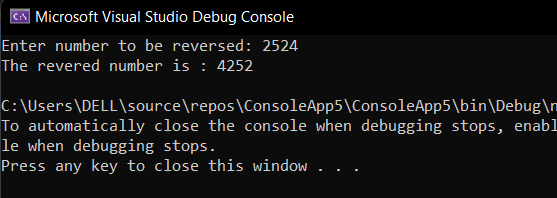

# Recursive-function

## Aim: 
To write a C# program to reverse a number using recursive function.

## Algorithm:
### Step 1:
Create a function for reversing.

### Step 2:
Get the input from the user.

### Step 3:
In the function find reminder of the number and multiply it by 10 and add the reverse number.

### Step 4:
Recrseively calling the function to get the reversed number.

### Step 5:
print the reversed number.

## Program:
~~~
Developed by : Kiran J
Ref no : 212221240022
~~~
~~~python
using System;
namespace hello
{
    class program
    {
        int  rev = 0,rem;
        public int reverse(int n)
        {
            rem = n % 10;
            if (rem == 0)
            {
                return rev;
            }
            else
            {
                rem = n % 10;
                rev = rev * 10 + rem;
                n = n /10;
                return reverse(n);
            }
        }
    }
    class name
    {
        static void Main(string[] args)
        {
            int n;
            Console.Write("Enter number to be reversed: ");
            n = Convert.ToInt32(Console.ReadLine());

            program p = new program();
            Console.WriteLine("The revered number is : " + p.reverse(n));
        }
    }
}
~~~

## Output:

## Result:
Thus, C# program to reverse a number using recursive function is executed successfully.
